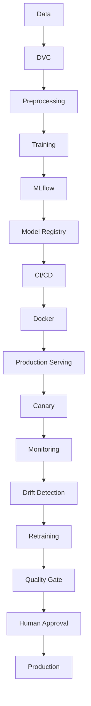

# Arabic Sentiment Analysis MLOps

A production-oriented MLOps project for Arabic sentiment classification using a transformer-based deep learning model. The planned model family is Arabic BERT, such as AraBERT.

## Dataset

This project uses the HARD Arabic Hotel Reviews Dataset. The raw dataset is located at `data/raw/balanced-reviews.txt`. It is encoded as UTF-16 little-endian and uses tab-separated fields. The raw file is preserved unchanged.

## Phase 1 — Data ingestion and preprocessing

The Phase 1 pipeline reads and validates the raw schema, conservatively cleans review whitespace, maps ratings 1 and 2 to `negative` and 4 and 5 to `positive`, and writes deterministic 80/10/10 train, validation, and test CSV files. Duplicate cleaned review text is kept together within a single split to prevent text leakage. The output schema is `review`, `rating`, `sentiment`; the CSV files use UTF-8. Measured dataset details and split results are in [reports/module-1.md](reports/module-1.md).

Run it from the project root with:

```bash
PYTHONPATH=src .venv/bin/python -m arabic_sentiment
```

This command runs the data pipeline only. It uses pandas and does not modify the raw dataset or train a model.

## Phase 2 — Baseline deep learning model

The project now includes a locally trained AraBERTv0.2-base binary sentiment classifier. The model is fine-tuned on a deterministic, class-proportional sample of 5,000 rows from the existing training split; the complete validation and test splits are used. The saved model and tokenizer are in `models/baseline-arabert/`. Training details and measured metrics are in [reports/module-2.md](reports/module-2.md).

Train the baseline from the project root with:

```bash
PYTHONPATH=src .venv/bin/python -m arabic_sentiment.train --config configs/baseline.json
```

For one local prediction, load the saved model with `SentimentPredictor` from `arabic_sentiment.inference`. This is the model-level helper used by the Phase 3 API adapter.

## Phase 3 — FastAPI

The local API loads the saved artifact in `models/baseline-arabert/` through a serving adapter that wraps `SentimentPredictor`. Model inference runs on CPU. The model and tokenizer load locally on the first prediction request.

Start the API from the project root with:

```bash
PYTHONPATH=src .venv/bin/python -m arabic_sentiment.api
```

`GET /health` returns the API health status. `POST /predict` accepts `{"review": "...Arabic review..."}` and returns `label`, `confidence`, and `model_version`. The saved training checkpoint and seed form the reported model version.

## Phase 4 — Docker

The API image is built from `Dockerfile` with Python 3.13 and the pinned CPU-only inference dependencies in `requirements-api.txt`. The model is intentionally kept outside the image and outside Git. Supply it at runtime by mounting the local artifact read-only and setting `SENTIMENT_MODEL_DIR`; the prediction-service adapter can later load a promoted artifact from another provider without changing the HTTP routes.

Build with the host UID/GID so the non-root process can read the mounted artifact (the local weight file is owner-readable):

```bash
docker build \
  --build-arg APP_UID="$(id -u)" \
  --build-arg APP_GID="$(id -g)" \
  -t arabic-sentiment-mlops:phase4 .
```

Run the API with the local artifact mounted read-only:

```bash
docker run --rm --name arabic-sentiment-api \
  -p 8000:8000 \
  -v "$PWD/models/baseline-arabert:/models/baseline-arabert:ro" \
  -e SENTIMENT_MODEL_DIR=/models/baseline-arabert \
  arabic-sentiment-mlops:phase4
```

The `.dockerignore` excludes `models/` and `data/`, keeping the baseline weights and datasets out of the build context.

## Development approach

The project will be developed incrementally according to the MLOps project requirements. The data pipeline, baseline classifier, FastAPI interface, and Docker container validation are implemented; later roadmap components remain planned work.

## Preliminary project roadmap

1. Project foundation
2. Data ingestion and preprocessing
3. Baseline deep learning model
4. Packaging and API
5. Docker
6. MLflow and DVC
7. CI/CD
8. Production serving with BentoML
9. Load testing and canary deployment
10. Model optimization
11. Monitoring and drift detection
12. Retraining and model promotion
13. Final integration and documentation

## Preliminary architecture

The following diagram is a preliminary end-to-end plan. Data processing, baseline training, the API, and Docker packaging for local API validation are implemented; tracking, registry, production serving, monitoring, and retraining components remain planned.



## Project status

See [PROJECT_STATUS.md](PROJECT_STATUS.md) for the implementation checklist.
