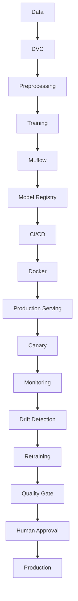

# Arabic Sentiment Analysis MLOps

A production-oriented MLOps project for Arabic sentiment classification using a transformer-based deep learning model. The planned model family is Arabic BERT, such as AraBERT.

## Dataset

This project uses the HARD Arabic Hotel Reviews Dataset. The raw dataset is located at `data/raw/balanced-reviews.txt`. It is encoded as UTF-16 little-endian and uses tab-separated fields. The raw file is preserved unchanged.

## Phase 1 — Data ingestion and preprocessing

The Phase 1 pipeline reads and validates the raw schema, conservatively cleans review whitespace, maps ratings 1 and 2 to `negative` and 4 and 5 to `positive`, and writes deterministic 80/10/10 train, validation, and test CSV files. Duplicate cleaned review text is kept together within a single split to prevent text leakage. The output schema is `review`, `rating`, `sentiment`; the CSV files use UTF-8. Measured dataset details and split results are in [reports/module-1.md](reports/module-1.md).

Run it from the project root with:

```bash
PYTHONPATH=src .venv/bin/python -m arabic_sentiment
```

This command runs the data pipeline only. It uses pandas and does not modify the raw dataset or train a model.

## Phase 2 — Baseline deep learning model

The project now includes a locally trained AraBERTv0.2-base binary sentiment classifier. The model is fine-tuned on a deterministic, class-proportional sample of 5,000 rows from the existing training split; the complete validation and test splits are used. The saved model and tokenizer are in `models/baseline-arabert/`. Training details and measured metrics are in [reports/module-2.md](reports/module-2.md).

Train the baseline from the project root with:

```bash
PYTHONPATH=src .venv/bin/python -m arabic_sentiment.train --config configs/baseline.json
```

For one local prediction, load the saved model with `SentimentPredictor` from `arabic_sentiment.inference`. This is a model-level helper; no API server is included in this phase.

## Development approach

The project will be developed incrementally according to the MLOps project requirements. The data pipeline and baseline classifier are implemented; later roadmap components remain planned work.

## Preliminary project roadmap

1. Project foundation
2. Data ingestion and preprocessing
3. Baseline deep learning model
4. Packaging and API
5. Docker
6. MLflow and DVC
7. CI/CD
8. Production serving with BentoML
9. Load testing and canary deployment
10. Model optimization
11. Monitoring and drift detection
12. Retraining and model promotion
13. Final integration and documentation

## Preliminary architecture

The following diagram is a preliminary end-to-end plan. Data processing and baseline training are implemented; later-stage tracking, deployment, serving, monitoring, and retraining components remain planned.



## Project status

See [PROJECT_STATUS.md](PROJECT_STATUS.md) for the implementation checklist.
