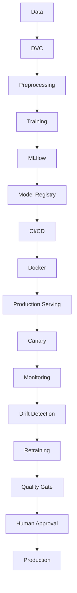

# Arabic Sentiment Analysis MLOps

A production-oriented MLOps project for Arabic sentiment classification using a transformer-based deep learning model. The planned model family is Arabic BERT, such as AraBERT.

## Dataset

This project uses the HARD Arabic Hotel Reviews Dataset. The raw dataset is located at `data/raw/balanced-reviews.txt`. It is encoded as UTF-16 little-endian and uses tab-separated fields. Dataset details and statistics will be inspected and documented during the data phase; no final statistics or model results are claimed here.

## Development approach

The project will be developed incrementally according to the MLOps project requirements. Components shown in the roadmap and architecture below are planned work and are not claimed to be implemented yet.

## Preliminary project roadmap

1. Project foundation
2. Data ingestion and preprocessing
3. Baseline deep learning model
4. Packaging and API
5. Docker
6. MLflow and DVC
7. CI/CD
8. Production serving with BentoML
9. Load testing and canary deployment
10. Model optimization
11. Monitoring and drift detection
12. Retraining and model promotion
13. Final integration and documentation

## Preliminary architecture

The following diagram is a conceptual plan. Its components and flows have not been implemented or validated yet.

## Project status

See [PROJECT_STATUS.md](PROJECT_STATUS.md) for the implementation checklist.
