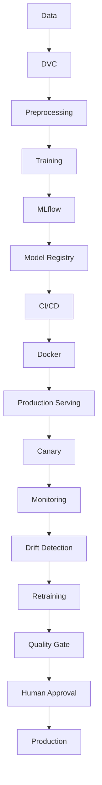

# Arabic Sentiment Analysis MLOps

A production-oriented MLOps project for Arabic sentiment classification using a transformer-based deep learning model. The planned model family is Arabic BERT, such as AraBERT.

## Installation

Install the project and its pinned runtime dependencies in editable mode:

```bash
python -m pip install -e .
```

For development and tests, install the development tools as well:

```bash
python -m pip install -e ".[dev]"
```

## Dataset

This project uses the HARD Arabic Hotel Reviews Dataset. The raw dataset is located at `data/raw/balanced-reviews.txt`. It is encoded as UTF-16 little-endian and uses tab-separated fields. The raw file is preserved unchanged.

## Phase 1 — Data ingestion and preprocessing

The Phase 1 pipeline reads and validates the raw schema, conservatively cleans review whitespace, maps ratings 1 and 2 to `negative` and 4 and 5 to `positive`, and writes deterministic 80/10/10 train, validation, and test CSV files. Duplicate cleaned review text is kept together within a single split to prevent text leakage. The output schema is `review`, `rating`, `sentiment`; the CSV files use UTF-8. Measured dataset details and split results are in [reports/module-1.md](reports/module-1.md).

Run it from the project root with:

```bash
PYTHONPATH=src .venv/bin/python -m arabic_sentiment
```

This command runs the data pipeline only. It uses pandas and does not modify the raw dataset or train a model.

## Phase 2 — Baseline deep learning model

The official project baseline is AraBERTv0.2-base (`aubmindlab/bert-base-arabertv02`) fine-tuned on all 84,558 training rows in Google Colab on a Tesla T4. The clean local inference artifact is `models/full-gpu-arabert-inference/`; the older `models/baseline-arabert/` artifact is the historical CPU-constrained 5,000-row experiment and is not the official baseline. Training details and measured metrics are in [reports/module-2.md](reports/module-2.md).

The earlier CPU-constrained 5K training command is retained for historical reproducibility; it does not recreate the official full-dataset GPU baseline and should not be used for the current baseline:

```bash
PYTHONPATH=src .venv/bin/python -m arabic_sentiment.train --config configs/baseline.json
```

For one local prediction, load the saved model with `SentimentPredictor` from `arabic_sentiment.inference`. This is the model-level helper used by the Phase 3 API adapter.

## Phase 3 — FastAPI

The local API loads the official artifact in `models/full-gpu-arabert-inference/` when present, with `models/baseline-arabert/` as a compatibility fallback. The serving adapter wraps `SentimentPredictor`; model inference runs on CPU and weights load on the first prediction request.

Start the API from the project root with:

```bash
PYTHONPATH=src .venv/bin/python -m arabic_sentiment.api
```

`GET /health` returns the API health status. `POST /predict` accepts `{"review": "...Arabic review..."}` and returns `label`, `confidence`, and `model_version`. The saved training checkpoint and seed form the reported model version.

## Phase 4 — Docker

The API image is built from `Dockerfile` with Python 3.13 and the pinned CPU-only inference dependencies in `requirements-api.txt`. The model is intentionally kept outside the image and outside Git. Supply it at runtime by mounting the local artifact read-only and setting `SENTIMENT_MODEL_DIR`; the prediction-service adapter can later load a promoted artifact from another provider without changing the HTTP routes.

Build with the host UID/GID so the non-root process can read the mounted artifact (the local weight file is owner-readable):

```bash
docker build \
  --build-arg APP_UID="$(id -u)" \
  --build-arg APP_GID="$(id -g)" \
  -t arabic-sentiment-mlops:phase4 .
```

Run the API with the local artifact mounted read-only:

```bash
docker run --rm --name arabic-sentiment-api \
  -p 8000:8000 \
  -v "$PWD/models/full-gpu-arabert-inference:/models/full-gpu-arabert-inference:ro" \
  -e SENTIMENT_MODEL_DIR=/models/full-gpu-arabert-inference \
  arabic-sentiment-mlops:phase4
```

The `.dockerignore` excludes `models/` and `data/`, keeping the baseline weights and datasets out of the build context.

## Phase 5 — MLflow tracking and registry

MLflow records the already-trained Colab baseline and deterministic local evaluation runs. It does not train the official model. Tracking and registry metadata use local SQLite storage in `mlflow.db`; run artifacts are stored under `mlartifacts/`. These generated paths are ignored by Git. The MLflow package is in the training/management dependencies, not `requirements-api.txt`, so the Docker inference image retains its filesystem fallback without requiring MLflow.

Run baseline registration and the configured CPU-only evaluations with:

```bash
PYTHONPATH=src HF_HUB_OFFLINE=1 .venv/bin/python -m arabic_sentiment.mlflow_experiments
```

The registered model is `arabic-sentiment`. The selected artifact can be loaded by setting `SENTIMENT_MODEL_URI=models:/arabic-sentiment@candidate` or `models:/arabic-sentiment@production`; the FastAPI routes continue to use the serving adapter and do not import MLflow. Without that setting, the adapter selects the local filesystem artifact. MLflow alias loading requires MLflow in the API runtime, so the current Docker image uses the filesystem fallback. The `candidate` and `production` aliases are set only after the explicit quality gate confirms the official full-split validation and test F1 each meet or exceed the historical 5K CPU baseline and the registry model loads and predicts correctly. A registry alias is not a live production deployment. Run configurations, actual MLflow IDs/metrics, registry traceability, and limitations are in [reports/module-5.md](reports/module-5.md).

Project-created MLflow runs now receive `dvc.dataset_hash`, read from `data/raw/balanced-reviews.txt.dvc`, plus the current `git_commit` revision. This records the DVC raw-data content hash for future runs and supports the lineage `MLflow run → DVC dataset hash → Git revision`. Historical runs predate this tag and are left unchanged. The DVC TF-IDF + Logistic Regression pipeline is a reproducibility demonstration; it is separate from the official AraBERT model and Registry entry.

## Phase 6 — DVC data versioning and reproducibility

The raw HARD dataset is tracked by DVC at `data/raw/balanced-reviews.txt`, with its Git-manageable pointer at `data/raw/balanced-reviews.txt.dvc`. The pointer currently records MD5 `8b3523338727a05a3f8bac9522073b75`. The `minio` DVC remote uses bucket `arabic-sentiment-dvc` at the local MinIO S3 endpoint. Credentials are supplied through ignored local configuration (`.dvc/config.local` and `.env.minio`); the Compose service stores MinIO data in a Docker-managed named volume outside the repository.

The local reproducibility pipeline in `dvc.yaml` is `prepare → train → evaluate`, configured by `params.yaml` (seed 42 and 80/10/10 splits). Its model is TF-IDF + Logistic Regression and is **only** a lightweight DVC demonstration. The official baseline and production/registry model remains the full-GPU AraBERT model at `models/full-gpu-arabert-inference/`.

Run the pipeline and inspect its computed metrics with:

```bash
dvc repro
dvc metrics show
dvc metrics diff
```

The unchanged Phase 6.5 pipeline was observed to skip all three stages; changing only `model.C` caused DVC to keep `prepare` cached and rerun `train` and `evaluate`, and restoring `C=1.0` restored the cached outputs. Evaluation metrics are computed for validation and test splits. In the final remote-cache audit, the raw dataset was present in MinIO; DVC reported the generated processed splits, lightweight model, and metrics as new to the remote cache, so those generated outputs have not been uploaded. The local pipeline itself reports up to date.

Project-created MLflow runs include `dvc.dataset_hash` extracted from the raw data pointer and the current Git `HEAD` as `git_commit`. Historical MLflow runs were not changed because they predate this tag and do not establish the DVC hash of their training data. See [reports/module-5.md](reports/module-5.md) for the historical provenance limitation.

## Development approach

The project is developed incrementally according to the MLOps project requirements. The data pipeline, official baseline, FastAPI interface, Docker container validation, and local MLflow tracking/registry workflow are implemented; later roadmap components remain planned work.

## Preliminary project roadmap

1. Project foundation
2. Data ingestion and preprocessing
3. Baseline deep learning model
4. Packaging and API
5. Docker
6. MLflow and DVC
7. CI/CD
8. Production serving with BentoML
9. Load testing and canary deployment
10. Model optimization
11. Monitoring and drift detection
12. Retraining and model promotion
13. Final integration and documentation

## Preliminary architecture

The following diagram is a preliminary end-to-end plan. Data processing, DVC dataset tracking and reproducibility pipeline, the AraBERT baseline, API, Docker packaging for local API validation, and local MLflow tracking/registry are implemented. CI/CD, production serving, monitoring, and retraining components remain planned.



## Project status
